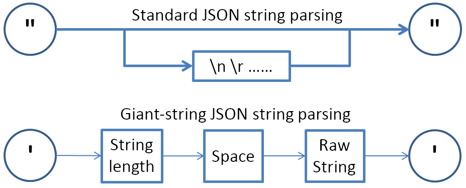

# GS_JSON (Giant-string JSON) for Java and Python



Nowadays, JSON is becoming more and more popular in mobile and various front-end/back-end development.
As HTML5 supports base64 embedded audio/video/image, sometimes JSON strings are very large as it can contain base64 embedded media. However, since native JSON string encoding escapes all characters outside 0x20 and 0x7f (see <https://www.json.org/json-en.html> ), when the original string is super long, i.e., of many or even hundreds of megabytes, parsing a JSON string or serializing a JSON object will become very slow and energy inefficient (especially for mobile apps).

This repository provides an elegant solution by skipping encoding extremely long strings (whereby the length threshold can be set by the user, by default 1024). It introduces a new variant of encoded string beginning with a single-quote, followed by the string length integer, followed with a space character, followed by the original unescaped string, and lastly followed by an ending single-quote. In this way, the JSON parser can read the string length and use pointer to extract the raw string without escaping every character in the string.

We provide both serializer and deserializer in Java. But for Python, currently we only provide serializer. Our code is based on <https://github.com/mitchhentges/json-parse> . Thanks to mitchhentges!

In the Java main function, we provide a benchmark comparison with state-of-the-art Java JSON library, GSON by Google.
Benchmark results show tremendous improvement in speed especially in parsing JSON objects:

```
Generating huge JSON object ...Done
Total length of all String objects = 537010898
GS_JSON Benchmark:
Converting JSON object to JSON string ... 3.946s (output length=537021909)
Converting JSON string to JSON object ...0.149s
Java JSON library GSON Benchmark:
Converting JSON object to JSON string ... 9.632s (output length=1132769169)
Converting JSON string to JSON object ...10.71s
```